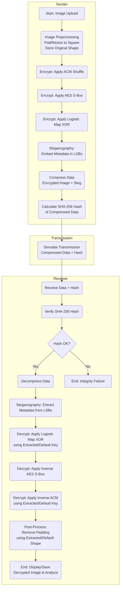
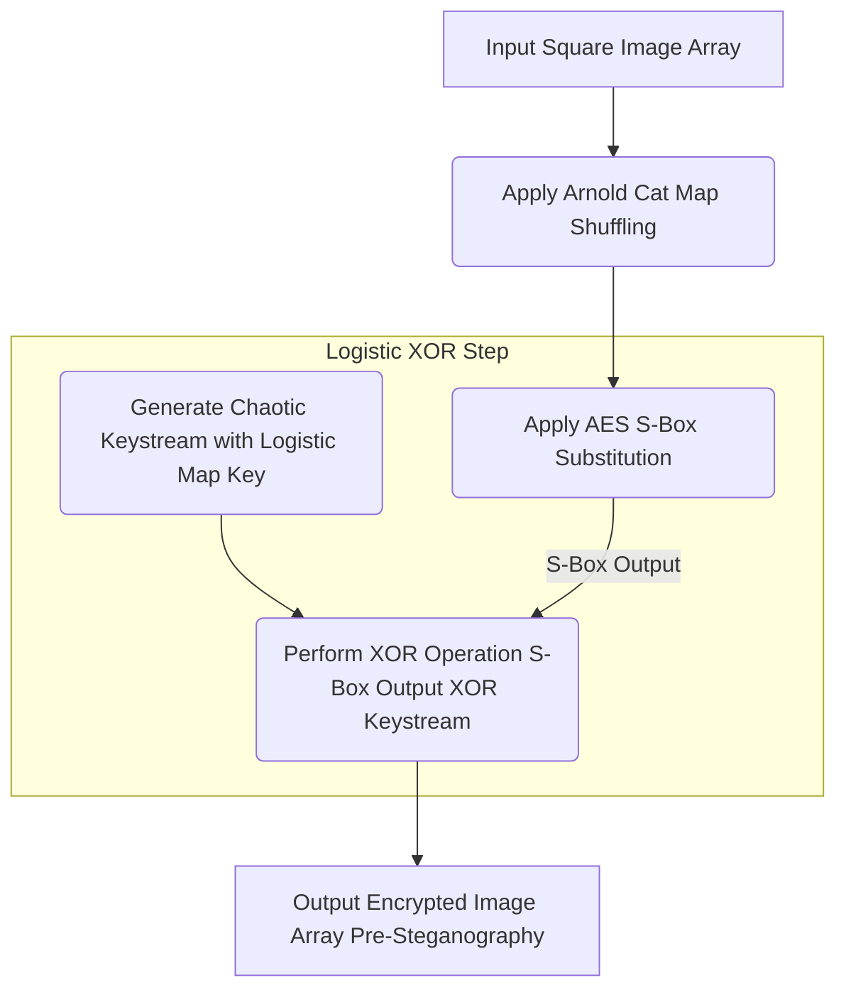
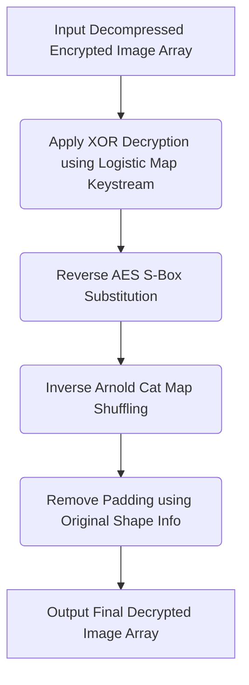

# Project Report
# Secure and Efficient Image Encryption with Compression and Metadata Embedding

## Table of Contents

1. [Introduction](#1-introduction)
2. [Background and Motivation](#2-background-and-motivation)
3. [Project Objectives](#3-project-objectives)
4. [Methodology](#4-methodology)
   - [Process Overview](#process-overview)
   - [Encryption Techniques and Additional Layers](#encryption-techniques-and-additional-layers)
   - [Data Compression and Integrity Checks](#data-compression-and-integrity-checks)
   - [Metadata Embedding via Steganography](#metadata-embedding-via-steganography)
5. [Mathematical Foundations](#5-mathematical-foundations)
   - [Arnold Cat Map Reversibility](#arnold-cat-map-reversibility)
   - [Logistic Map Chaos and Sensitivity](#logistic-map-chaos-and-sensitivity)
   - [AES S-box Non-Linearity](#aes-s-box-non-linearity)
   - [XOR Operation Properties](#xor-operation-properties)
6. [Algorithm Design Techniques](#6-algorithm-design-techniques)
   - [Chaos-Based Encryption Strategy](#chaos-based-encryption-strategy)
   - [Compression Algorithm Design](#compression-algorithm-design)
   - [Steganography Implementation Approach](#steganography-implementation-approach)
   - [Hashing and Verification Design](#hashing-and-verification-design)
7. [System Architecture and Flowcharts](#7-system-architecture-and-flowcharts)
   - [Overall Process Flowchart](#overall-process-flowchart)
   - [Detailed Encryption Flowchart](#detailed-encryption-flowchart)
   - [Detailed Decryption Flowchart](#detailed-decryption-flowchart)
8. [Implementation Details](#8-implementation-details)
   - [Image Preprocessing](#image-preprocessing)
   - [Encryption and Decryption Routines](#encryption-and-decryption-routines)
   - [Compression, Hashing, and Verification Steps](#compression-hashing-and-verification-steps)
   - [Metadata Embedding and Extraction](#metadata-embedding-and-extraction)
9. [Performance and Security Analysis](#9-performance-and-security-analysis)
   - [Performance Metrics](#performance-metrics)
   - [Security Considerations and Key Sensitivity](#security-considerations-and-key-sensitivity)
   - [Security Enhancements Discussion](#security-enhancements-discussion)
10. [Experimental Results and Discussion](#10-experimental-results-and-discussion)
11. [Conclusion](#11-conclusion)
12. [Results](#12-results)

---

## 1. Introduction

The exponential growth of digital data necessitates robust methods for secure image transmission. This project details a hybrid image encryption system combining spatial shuffling (Arnold's Cat Map - ACM), byte substitution (AES S-box), and chaotic encryption (Logistic Map). The resulting encrypted image data is losslessly compressed using zlib for efficiency, its integrity verified using SHA-256 hashing, and critical decryption metadata is embedded within the encrypted data stream via Least Significant Bit (LSB) steganography. 

The system is designed for flexibility, supporting execution in environments like Google Colab and Jupyter Notebooks. This report covers the methodology, implementation, security analysis, and performance evaluation of the enhanced system.

---

## 2. Background and Motivation

Traditional image encryption methods often rely solely on pixel value modification or spatial rearrangement, leaving them potentially vulnerable to statistical or pattern recognition attacks. This project was motivated by combining multiple cryptographic approaches into a layered encryption strategy:

- **ACM** provides confusion through spatial rearrangement
- **Logistic Map** delivers diffusion properties
- **AES S-box substitution** adds strong non-linearity to bolster security against differential cryptanalysis

The system addresses practical transmission concerns through lossless compression (zlib) and ensures data integrity using SHA-256 hashing. Embedding metadata via steganography ensures that necessary decryption parameters (like keys and original image dimensions) travel securely with the encrypted data itself.

---

## 3. Project Objectives

The primary objectives of this project are to:

* Develop a multi-stage encryption mechanism combining spatial shuffling (ACM), non-linear byte substitution (AES S-box), and chaotic pixel value encryption (Logistic Map XOR)
* Implement lossless compression (zlib) on the encrypted image data to reduce transmission size
* Integrate SHA-256 hashing for verifying the integrity of the compressed data upon reception
* Embed critical metadata (including encryption keys, original dimensions, padding status) securely within the encrypted image data using LSB steganography
* Ensure the system is functional and user-friendly across different execution environments (Colab, Jupyter, standard Python)
* Conduct thorough performance analysis (timing) and security evaluation (metrics like MSE, PSNR, SSIM, entropy, key sensitivity)

---

## 4. Methodology

### Process Overview

The secure image transmission pipeline involves the following key stages:

1. **Image Upload & Preprocessing:** 
   * Load the image, convert to a standard format (RGB or Grayscale)
   * Pad/resize to ensure square dimensions required for ACM
   * Store original dimensions

2. **Encryption Pipeline:**
   * Apply Arnold's Cat Map shuffling
   * Apply AES S-box substitution to the shuffled image bytes
   * Generate a chaotic keystream using the Logistic Map and apply XOR encryption to the S-box output

3. **Metadata Embedding (Steganography):** 
   * Embed essential parameters (keys, original shape, padding flag, etc.) into the LSBs of the encrypted image data

4. **Compression:** 
   * Compress the encrypted image data (now containing embedded metadata) using zlib

5. **Hashing:** 
   * Calculate the SHA-256 hash of the compressed byte stream

6. **Transmission (Simulated):** 
   * Transmit the compressed data and its SHA-256 hash

7. **Integrity Verification:** 
   * Upon reception, recalculate the SHA-256 hash of the received compressed data
   * Compare it with the transmitted hash
   * Proceed only if they match

8. **Decompression:** 
   * Decompress the received data using zlib

9. **Metadata Extraction (Steganography):** 
   * Extract the embedded metadata from the LSBs of the decompressed data

10. **Decryption Pipeline (using extracted/default parameters):**
    * Apply XOR decryption using the Logistic Map keystream
    * Apply the inverse AES S-box substitution
    * Apply the inverse Arnold's Cat Map shuffling

11. **Post-processing:** 
    * Remove padding based on the extracted original dimensions

12. **Analysis & Output:** 
    * Display/save the decrypted image
    * Evaluate performance/security metrics

### Encryption Techniques and Additional Layers

The system employs a three-pronged encryption approach:

1. **Arnold's Cat Map (ACM):** 
   * Provides spatial confusion by deterministically rearranging pixel locations
   * Requires a square image
   * Reversible by applying the inverse transformation

2. **AES S-box Substitution:** 
   * Introduces non-linearity by substituting each byte of the image data
   * Based on the standardized Advanced Encryption Standard (AES) S-box lookup table
   * Significantly enhances resistance against differential and linear cryptanalysis

3. **Logistic Map Encryption:** 
   * Provides diffusion by generating a pseudo-random chaotic keystream
   * Based on sensitive initial parameters (x0, r)
   * Keystream is XORed with the image data pixel-by-pixel (or byte-by-byte)

The specific order during encryption is crucial: ACM Shuffling → AES S-box Substitution → Logistic Map XOR.

### Data Compression and Integrity Checks

After encryption and metadata embedding, the resulting image data (as a NumPy array) is converted to bytes and compressed using the `zlib` library (level 7 compression). This reduces the data volume for efficient storage or transmission.

For integrity verification, the SHA-256 hash of the *compressed* byte stream is calculated before transmission. The recipient recalculates the SHA-256 hash of the received compressed data and compares it to the transmitted hash. A mismatch indicates that the data was corrupted or tampered with during transit.

### Metadata Embedding via Steganography

To ensure the recipient has the necessary information for decryption without transmitting keys separately, critical parameters are embedded directly into the encrypted image using LSB steganography *before* compression. The embedded metadata includes:

* Encryption parameters (ACM iterations, a, b, Logistic Map x0, r)
* Original image dimensions (unpadded shape, padded shape)
* Data type (`dtype`)
* Padding status flag (`padded`)
* Descriptive information (e.g., application name, timestamp)

A 4-byte length header precedes the JSON-encoded metadata, allowing the extraction process to know how many bits to read from the LSBs after decompression.

---

## 5. Mathematical Foundations

### Arnold Cat Map Reversibility

The Arnold Cat Map T(x, y) = [(x + b*y) mod N, (a*x + (a*b+1)*y) mod N] is a transformation on a discrete grid. Its determinant is (1 * (ab+1)) - (b * a) = 1. A determinant of 1 ensures the map is area-preserving and reversible over integer coordinates modulo N. 

The inverse map exists and can be found by solving for (x, y) or using the inverse matrix modulo N. Applying the inverse map for the same number of iterations restores the original configuration.

### Logistic Map Chaos and Sensitivity

The Logistic Map, defined by the recurrence relation xn+1 = r * xn * (1 - xn), is a simple non-linear equation that exhibits complex chaotic behavior for certain values of the parameter *r* (typically 3.57 < r ≤ 4.0) and initial condition 0 < x0 < 1. Key properties include:

* **Sensitivity to Initial Conditions:** 
  * Tiny changes in x0 or r lead to exponentially diverging sequences over time (the "butterfly effect")
  * This makes the generated keystream highly dependent on the secret keys (x0, r)

* **Pseudo-randomness:** 
  * The generated sequence appears random and unpredictable for chaotic parameters
  * Makes it suitable for cryptographic keystreams

### AES S-box Non-Linearity

The AES S-box is a crucial component of the Advanced Encryption Standard. It is a non-linear substitution table that maps an 8-bit input byte to an 8-bit output byte. Its construction involves finite field mathematics (specifically, multiplicative inverse in GF(2^8) followed by an affine transformation). 

Its primary cryptographic function is to provide confusion and resistance against linear and differential cryptanalysis by breaking linear relationships between input and output bits. Applying it byte-wise across the image adds a strong layer of non-linearity independent of the chaotic map.

### XOR Operation Properties

The bitwise Exclusive OR (XOR) operation (denoted by ⊕) is fundamental in stream ciphers. Its key properties are:

* **Self-Inverting:** A ⊕ B ⊕ B = A. Any value XORed twice with the same key returns the original value.
* **Commutative & Associative:** A ⊕ B = B ⊕ A; (A ⊕ B) ⊕ C = A ⊕ (B ⊕ C).
* **Zero Identity:** A ⊕ 0 = A.

These properties allow the same `logistic_map_encrypt_decrypt` function (which uses XOR) to be used for both encryption and decryption, provided the exact same keystream is generated using the correct keys.

---

## 6. Algorithm Design Techniques

### Chaos-Based Encryption Strategy

The encryption scheme uses a deliberate layering approach based on Shannon's principles of confusion and diffusion:

* **Divide and Conquer Technique**: The encryption problem is decomposed into spatial rearrangement (ACM), byte substitution (AES S-box), and value transformation (Logistic Map XOR), addressing different aspects of security.

* **Parameter Tuning**: The chaotic behavior of the Logistic Map requires careful parameter selection within specific ranges (r between 3.57 and 4.0) where the system exhibits strong chaotic properties.

* **Period Analysis for ACM**: Arnold Cat Map iteratively applied to a square image eventually returns to its original state after a specific number of iterations (period). The encryption algorithm uses this property by choosing iteration counts less than the period for encryption, ensuring reversibility.

* **Dynamic Programming for Keystream Generation**: The Logistic Map keystream generation employs dynamic programming principles, storing each generated value for use in calculating the next, avoiding redundant recalculations.

### Compression Algorithm Design

The zlib compression implementation uses several algorithmic strategies:

* **Greedy Approach**: The DEFLATE algorithm (used within zlib) employs a greedy approach when selecting LZ77 matches, choosing the longest possible match at each step to maximize compression.

* **Huffman Coding**: After LZ77 compression, the data undergoes Huffman coding, which builds optimal prefix codes based on symbol frequencies - a classic example of a greedy algorithm producing an optimal solution.

* **Sliding Window Techniques**: The LZ77 component uses a sliding window approach (dictionary compression) that maintains a fixed-size buffer of previously seen data to identify repeating patterns.

* **Trade-off Optimization**: The compression level (set to 7) represents a balance between compression ratio and computational complexity, targeting an optimal point in the performance-efficiency trade-off curve.

### Steganography Implementation Approach

The LSB steganography implementation uses several design techniques:

* **Bit Manipulation**: The core algorithm uses efficient bitwise operations (AND, OR) to clear and set individual bits without affecting the others.

* **Sequential Access Pattern**: The metadata embedding follows a sequential access pattern, utilizing the fact that accessing array elements in order (rather than randomly) improves cache locality.

* **Header-Payload Structure**: A 4-byte length header precedes the actual metadata, employing a common protocol design technique to enable dynamic payload handling.

* **JSON Serialization**: The metadata is structured as JSON, leveraging its compact representation and universal compatibility over custom binary formats.

### Hashing and Verification Design

The integrity verification approach uses:

* **Collision Resistance**: SHA-256 was selected for its strong collision resistance properties, making it computationally infeasible to find two different inputs producing the same hash output.

* **Merkle-Damgård Construction**: The underlying design of SHA-256 follows the Merkle-Damgård construction, which iteratively applies a compression function to blocks of the input message.

* **Side-Channel Prevention**: The hash comparison uses a constant-time string comparison approach rather than short-circuiting at the first mismatch, mitigating potential timing attacks.

---

## 7. System Architecture and Flowcharts
### Simplified Process Flow


### > Overall Process Flowchart

### Detailed Encryption Flowchart

### Detailed Decryption Flowchart


---

## 8. Implementation Details

### Image Preprocessing

The `preprocess_image` function handles:
* Loading the image from various sources (bytes, file path, PIL object)
* Converting it to RGB (handling RGBA transparency) or grayscale
* Optionally resizing
* Padding it with black pixels to achieve square dimensions necessary for the Arnold Cat Map

It returns:
* The processed NumPy array
* The original dimensions `(width, height)` before padding
* A boolean flag `padded` indicating if padding was applied

### Encryption and Decryption Routines

#### Encryption (`encrypt_image`)

The `encrypt_image` function orchestrates the three core encryption steps in sequence on the preprocessed (square, padded) image array:

1. Calls `arnold_cat_map` with the specified iterations and parameters (a, b)
2. Calls `apply_aes_sbox` on the output of the ACM shuffle
3. Calls `logistic_map_encrypt_decrypt` (which generates the keystream using x0, r and performs XOR) on the output of the S-box substitution

It returns the final encrypted NumPy array and the time taken.

#### Decryption (`decrypt_image`)

The `decrypt_image` function reverses the process, operating on the *decompressed* encrypted image array. It uses parameters potentially retrieved from the extracted metadata (or falls back to global defaults):

1. Calls `logistic_map_encrypt_decrypt` (XOR with the keystream generated from the appropriate x0, r)
2. Calls `apply_inverse_aes_sbox` on the output of the XOR decryption
3. Calls `inverse_arnold_cat_map` on the output of the inverse S-box, using the appropriate iterations and parameters (a, b)
4. Removes padding:
   * Checks the `padded` flag
   * If true, retrieves the original `(height, width)` from the `original_shape_before_padding` parameter
   * Correctly slices `[:2]` to handle potential 3-element tuples from metadata
   * Slices the image array to remove the padding added during preprocessing

It returns the final decrypted (unpadded) image array and the time taken.

### Compression, Hashing, and Verification Steps

* **Compression (`compress_data`):** 
  * Takes the final encrypted NumPy array (potentially with embedded LSB metadata)
  * Converts it to bytes using `.tobytes()`
  * Compresses it using `zlib.compress()` with level 7

* **Hashing (`calculate_hash_bytes`):** 
  * Takes the compressed bytes
  * Computes the SHA-256 hash using `hashlib.sha256()`
  * Returns the hexadecimal digest

* **Verification (`verify_integrity_compressed`):** 
  * Recalculates the SHA-256 hash of the received compressed bytes
  * Compares it (string comparison) to the expected hash received alongside the data
  * Returns `True` if they match, `False` otherwise

### Metadata Embedding and Extraction

* **Embedding (`steghide_embed_metadata`):**
  * Takes the encrypted image array and a dictionary of metadata
  * Serializes the metadata dictionary into a compact JSON string, then encodes it to UTF-8 bytes
  * Prepends a 4-byte header representing the length of the metadata byte string (big-endian)
  * Checks if the image array has enough elements (pixels/bytes) to store the required number of bits (8 * payload length)
  * Flattens the image array and iterates through the payload bits (length header + metadata bytes)
  * For each image element corresponding to a payload bit, it clears the LSB (`& 0xFE`) and sets it to the payload bit (`| bit`)
  * Returns the modified image array containing the embedded metadata and a success flag

* **Extraction (`steghide_extract_metadata`):**
  * Takes the decompressed image array
  * Flattens the array and extracts the first 32 LSBs to reconstruct the 4-byte length header
  * Converts the length header bytes to an integer representing the metadata byte length
  * Performs sanity checks on this length
  * Extracts the required number of subsequent LSBs (metadata length * 8)
  * Reconstructs the metadata bytes from these bits
  * Decodes the bytes as UTF-8 and parses the JSON string back into a dictionary
  * Returns the extracted metadata dictionary or `None` on failure

---

## 9. Performance and Security Analysis

### Performance Metrics

Performance is measured via:

* **Execution Time:** Recording the time taken for distinct phases:
  * Encryption (`encrypt_image`)
  * Compression (`compress_data`)
  * Decompression (`decompress_data`)
  * Decryption (`decrypt_image`)

* **Image Quality Metrics (`calculate_metrics`):** Comparing the final decrypted image against the original unpadded image using:
  * **Mean Squared Error (MSE):** Lower is better
  * **Peak Signal-to-Noise Ratio (PSNR):** Higher is better (often measured in dB). Infinite PSNR indicates perfect reconstruction
  * **Structural Similarity Index (SSIM):** Value between -1 and 1, where 1 indicates perfect similarity
  * **Shannon Entropy:** Measures the randomness/uncertainty in pixel values. Encrypted images should have significantly higher entropy, approaching the maximum (8.0 for 8-bit images)

### Security Considerations and Key Sensitivity

The multi-layered approach enhances security:

* **ACM:** Provides spatial confusion, breaking pixel correlations
* **AES S-box:** Adds strong non-linear confusion, resisting differential/linear attacks
* **Logistic Map:** Provides diffusion via a chaotic, key-sensitive keystream for XOR encryption. High sensitivity means slightly wrong keys produce garbage output
* **SHA-256:** Ensures integrity, detecting accidental or malicious modifications to the *compressed* data during transit
* **LSB Steganography:** Hides keys and parameters *within* the encrypted data, avoiding separate transmission channels, although LSB modification is detectable by specialized analysis. The impact on the encrypted data's statistical properties is minimal but non-zero

**Key Sensitivity:** The Logistic Map is highly sensitive to its initial parameters (x0, r). The implementation includes a test where decryption is attempted with a slightly modified key (e.g., x0 + 1e-9). A successful test shows drastically different output (very low PSNR/SSIM) compared to decryption with the correct key, confirming the sensitivity.

### Security Enhancements Discussion

The system incorporates several features contributing to security:

* **Layered Encryption:** Combining shuffling (ACM), substitution (S-box), and chaotic XOR provides more robust security than any single method alone
* **AES S-box:** The addition of the S-box significantly hardens the scheme against standard cryptanalytic techniques compared to just ACM and Logistic Map
* **Integrity Verification:** Using SHA-256 prevents undetected modification of the transmitted data blob
* **Parameter Embedding:** Steganography helps manage keys and parameters securely by bundling them with the ciphertext

---

## 10. Experimental Results and Discussion

Implementation in Python using libraries like NumPy, Pillow, Matplotlib, Scikit-image, hashlib, and zlib was tested across environments. Key findings:

* **Encryption Effectiveness:** 
  * The combination of ACM, AES S-box, and Logistic Map XOR consistently transforms diverse input images into noise-like outputs
  * High entropy values (typically close to 8.0) indicate effective encryption
  * Histograms of encrypted images appear flat and uniform

* **Compression:** 
  * zlib compression typically achieves significant size reduction for the encrypted data
  * Beneficial for transmission/storage
  * Compression ratios vary depending on the encrypted image's (already high) entropy

* **Integrity:** 
  * The SHA-256 hash verification successfully detects any simulated tampering with the compressed data stream

* **Metadata Handling:** 
  * LSB steganography successfully embeds and extracts necessary decryption parameters
  * Enables correct reconstruction even when global parameters differ from those used for encryption

* **Decryption Fidelity:** 
  * When the integrity check passes and correct parameters (via metadata or defaults) are used, the decryption process yields an image visually identical to the original
  * Confirmed by very low MSE, high (often infinite) PSNR, and SSIM values close to 1.0

* **Key Sensitivity:** 
  * Tests confirm extreme sensitivity to the Logistic Map parameters (x0, r)
  * A minimal change results in a completely scrambled and unrecognizable decrypted image
  * Highlights the cryptographic strength derived from chaos

* **AES S-box Impact:** 
  * The inclusion of the S-box adds a computationally light but cryptographically significant non-linear layer
  * Theoretically increases resistance to known attacks without drastically impacting overall performance

---

## 11. Conclusion

This project presents a robust and efficient system for image encryption leveraging a hybrid approach. By combining the spatial confusion of Arnold's Cat Map, the strong non-linearity of the AES S-box, and the diffusive properties of Logistic Map-based chaotic encryption, it achieves a high degree of security.

Practical considerations are addressed through lossless zlib compression for efficiency, SHA-256 hashing for data integrity verification, and LSB steganography for secure embedding of essential decryption metadata. Performance analysis demonstrates effective encryption and high-fidelity decryption, while security analysis and key sensitivity tests confirm the system's robustness.

This multi-layered solution offers a strong foundation for secure image transmission in various applications. Future work could include implementing HMAC-SHA256 for authenticated encryption.

---
## 12. Results
### Example Single Run Result
-- Starting Image Processing Pipeline ---

--- Task 1: Preprocessing ---
Loaded image from uploaded data.
Original image mode: RGB, size: (6411, 3981)
Image is not square (3981x6411). Padding to make it square.
Padded image size: (6411, 6411)
Original image dimensions stored for metrics: (6411, 3981, 3)
Image array type after preprocessing: uint8, shape: (6411, 6411, 3)

--- Task 2: Encryption (ACM + S-Box + Logistic Map) ---
Starting Encryption Process...
Applying Arnold's Cat Map with 10 iterations (a=1, b=1)...
Applying AES S-box substitution...
Applying Logistic Map encryption (x0=0.3141592653589793, r=3.9999999)...
Encryption completed in 53.5780 seconds.
Encrypted image shape (before steg): (6411, 6411, 3), dtype: uint8

--- Task 2.5: Steganography - Embedding Metadata ---

--- Performing Steganography: Hiding Metadata ---
Metadata size: 494 bytes
Total payload with header: 498 bytes (3984 bits)
Successfully embedded 3984 bits of metadata
✅ Successfully embedded metadata using LSB steganography.
Final encrypted image shape (after steg attempt): (6411, 6411, 3), dtype: uint8

--- Task 3: Compression (zlib) ---
Starting Compression...
Compression (zlib level 7) completed in 9.4867 seconds.
Original size: 123302763 bytes, Compressed size: 97228068 bytes, Ratio: 0.7885

--- Task 4: Hashing Compressed Data ---
Calculated SHA-256 Hash of Compressed Data: 07cf4b01c8ca98e13615012dd2a0f7a3f5646683f0c7b814c52b3a1ec117b672

--- Tamper Verification (Compressed Data) ---
Expected Hash:  07cf4b01c8ca98e13615012dd2a0f7a3f5646683f0c7b814c52b3a1ec117b672
Calculated Hash:07cf4b01c8ca98e13615012dd2a0f7a3f5646683f0c7b814c52b3a1ec117b672
Integrity Check PASSED: Compressed data hashes match.

--- Task 5: Decompression (zlib) ---
Starting Decompression...
Decompression completed in 1.1449 seconds.
Decompressed image shape: (6411, 6411, 3), dtype: uint8

--- Task 5.5: Extracting Metadata from Steganography ---

--- Extracting Hidden Metadata from Steganography ---
Detected metadata length: 494 bytes
Successfully extracted metadata: 4 fields

--- Steganography Metadata Retrieved ---
```JSON
{
  "encrypted_by": "Enhanced Image Security System",
  "description": "Encrypted using ACM, AES S-box, Logistic Map, Compressed with zlib, Metadata via LSB Steg.",
  "timestamp": "2025-04-18 11:11:33 UTC",
  "encryption_params": {
    "acm_iterations": 10,
    "acm_a": 1,
    "acm_b": 1,
    "logistic_x0": 0.3141592653589793,
    "logistic_r": 3.9999999,
    "original_shape_unpadded": [
      6411,
      3981,
      3
    ],
    "original_shape_padded": [
      6411,
      6411,
      3
    ],
    "dtype": "uint8",
    "grayscale": false,
    "padded": true,
    "pre_steg_shape": [
      6411,
      6411,
      3
    ],
    "pre_steg_dtype": "uint8"
  }
}
```
--------------------------------------


--- Task 6: Decryption (Logistic Map -> Inv S-Box -> Inv ACM -> Unpad) ---
Using Decryption Parameters: ACM iter=10, a=1, b=1, x0=0.3141592653589793, r=3.9999999
Target Original Shape: (6411, 3981, 3), Padding Applied Originally: True
Starting Decryption Process (on decompressed data)...
Applying Logistic Map decryption (x0=0.3141592653589793, r=3.9999999)...
Applying Inverse AES S-box substitution...
Applying Inverse Arnold's Cat Map with 10 iterations (a=1, b=1)...
Removing padding to restore original size (6411, 3981, 3)...
Final decrypted size after unpadding: (6411, 3981)
Decryption completed in 52.8920 seconds.
Final decrypted image shape: (6411, 3981, 3), dtype: uint8

--- Task 7: Performance & Security Analysis ---

--- Timing ---
Encryption Time:   53.5780s
Compression Time:  9.4867s
Decompression Time:1.1449s
Decryption Time:   52.8920s
Total Time (Enc->Comp->Decomp->Dec): 117.1015s
Image dimensions processed (padded): (6411, 6411, 3)
Original unpadded dimensions: (6411, 3981, 3)

--- Similarity Metrics (Original Unpadded vs Final Decrypted) ---
MSE:  0.2813
PSNR: 53.6385 dB
SSIM: 0.9995
Entropy (Original):  4.7076
Entropy (Decrypted): 4.7076

--- Security Analysis (Original Unpadded vs Encrypted) ---
Entropy (Original Unpadded): 4.7076
Entropy (Encrypted - Pre Steg):  7.9208
Entropy increased significantly towards ideal random distribution (Good).


--- Key Sensitivity Test ---
Attempting decryption with slightly modified key (x0 = 0.314159266358979)...
Starting Decryption Process (on decompressed data)...
Applying Logistic Map decryption (x0=0.31415926635897934, r=3.9999999)...
Applying Inverse AES S-box substitution...
Applying Inverse Arnold's Cat Map with 10 iterations (a=1, b=1)...
Removing padding to restore original size (6411, 3981)...
Final decrypted size after unpadding: (6411, 3981)
Decryption completed in 53.9840 seconds.
Resulting PSNR (Wrong Key): 5.8309 dB
Resulting SSIM (Wrong Key): 0.0043
✅ Key sensitivity test PASSED: Decryption with slightly wrong key produced significantly different result.

--- Task 8: Saving and Downloading Output ---
Compressed encrypted data saved as: encrypted_compressed_data.zlib-steg
Final decrypted image saved as: decrypted_image.png
Initiating Colab downloads (if files were saved)...

--- Image Processing Script Execution Finished ---

### Average over 10 runs of different image sizes and types


