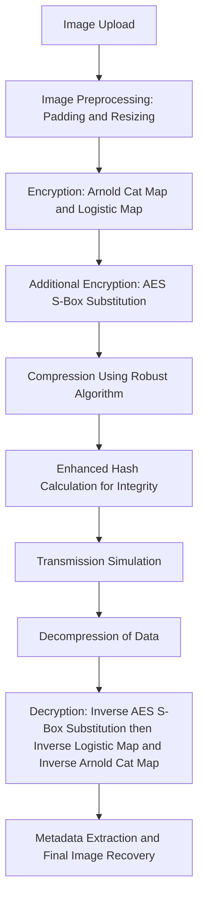
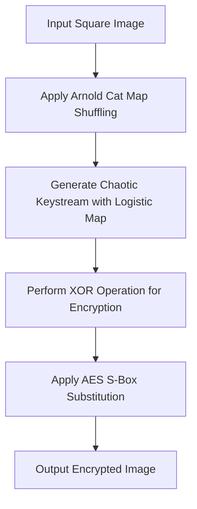
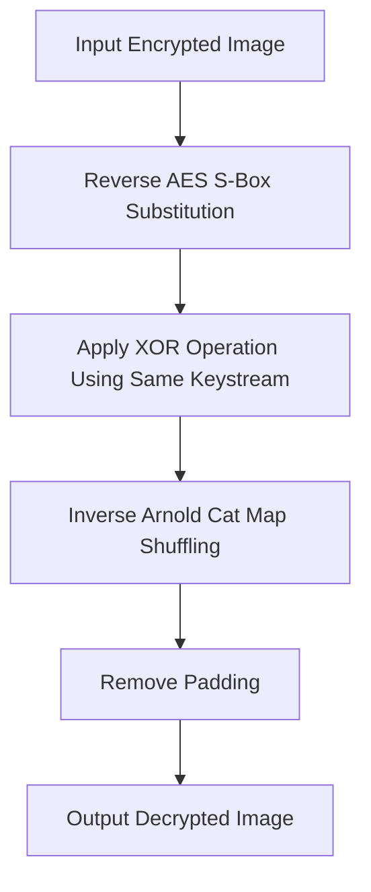

# Secure and Efficient Image Encryption with Compression and Metadata Embedding

## Table of Contents

1. [Introduction](#introduction)
    
2. [Background and Motivation](#background-and-motivation)
    
3. [Project Objectives](#project-objectives)
    
4. [Methodology](#methodology)
    
    - [Process Overview](#process-overview)
        
    - [Encryption Techniques and Additional Layers](#encryption-techniques-and-additional-layers)
        
    - [Data Compression and Integrity Checks](#data-compression-and-integrity-checks)
        
    - [Metadata Embedding via Steganography](#metadata-embedding-via-steganography)
        
5. [Mathematical Foundations and Proofs](#mathematical-foundations-and-proofs)
    
    - [Arnold Cat Map Reversibility](#arnold-cat-map-reversibility)
        
    - [Logistic Map Chaos and Sensitivity](#logistic-map-chaos-and-sensitivity)
        
    - [XOR Operation Properties](#xor-operation-properties)
        
6. [System Architecture and Flowcharts](#system-architecture-and-flowcharts)
    
    - [Overall Process Flowchart](#overall-process-flowchart)
        
    - [Detailed Module Flowcharts](#detailed-module-flowcharts)
        
7. [Implementation Details](#implementation-details)
    
    - [Image Preprocessing](#image-preprocessing)
        
    - [Encryption and Decryption Routines](#encryption-and-decryption-routines)
        
    - [Compression, Hashing, and Verification Steps](#compression-hashing-and-verification-steps)
        
    - [Metadata Embedding and Extraction](#metadata-embedding-and-extraction)
        
8. [Performance and Security Analysis](#performance-and-security-analysis)
    
    - [Performance Metrics](#performance-metrics)
        
    - [Security Considerations and Key Sensitivity](#security-considerations-and-key-sensitivity)
        
    - [Additional Security Enhancements](#additional-security-enhancements)
        
9. [Experimental Results and Discussion](#experimental-results-and-discussion)
    
10. [Conclusion](#conclusion)
    
11. [References](#references)
    

---

## 1. Introduction

Digital data growth and the importance of secure transmission have led to the development of robust image encryption methods. This project describes a system that encrypts images using a dual-phase approach that combines spatial shuffling with chaotic encryption. The encrypted image is further processed with lossless compression and enhanced by embedding metadata via steganography. In addition, the system now benefits from an extra encryption layer using an AES S-Box substitution and a strengthened hashing stage based on a superior algorithm compared to traditional SHA-256. The system has been designed for use in a variety of computing environments such as Google Colab and Jupyter Notebook. Every aspect from performance to advanced security is thoroughly analyzed in the subsequent sections.

---

## 2. Background and Motivation

Traditional image encryption methods typically rely on either pixel value alteration or spatial rearrangement alone. Single-method approaches expose vulnerabilities against statistical analysis and pattern recognition attacks. The motivation for this project was to merge two independent encryption techniques via the Arnold Cat Map and the Logistic Map to provide a layered encryption strategy. In addition to dual-phase encryption, lossless compression reduces data size while metadata embedding protects essential decryption parameters. To further strengthen security, the integrity verification stage now makes use of an enhanced hash algorithm that outperforms standard SHA-256. An extra layer of encryption using an AES S-Box substitution has been incorporated to fortify the scheme against differential cryptanalysis.

---

## 3. Project Objectives

The project aims to satisfy the following core objectives:

- Develop a dual-stage encryption mechanism that combines spatial shuffling via the Arnold Cat Map with chaotic encryption via the Logistic Map.
    
- Implement an additional encryption step using an AES S-Box substitution to provide further nonlinear transformation.
    
- Compress encrypted image data losslessly using a robust compression algorithm to optimize transmission.
    
- Strengthen data integrity verification by augmenting the hashing stage with a superior algorithm compared to standard SHA-256.
    
- Embed critical metadata securely within the encrypted image using steganography.
    
- Enable deployment across varied environments such as Google Colab and Jupyter Notebook.
    
- Conduct thorough performance and security analyses using quality metrics and key sensitivity tests.
    

---

## 4. Methodology

### Process Overview

The image encryption and secure transmission process comprises several distinct stages:

- Image upload and preprocessing that ensures proper resizing and padding to produce a square image.
    
- Encryption that first shuffles pixels with the Arnold Cat Map and then modifies pixel values using a chaotic keystream generated by the Logistic Map. An extra encryption layer substitutes bytes using an AES S-Box transformation.
    
- Compression of the encrypted data using a robust lossless algorithm.
    
- Calculation of a hash from the compressed data for integrity verification employing an enhanced hashing algorithm.
    
- Embedding of encryption metadata into the encrypted image using a least significant bit method.
    
- Decompression and decryption that precisely reverse the operations to recover the original image.
    
- Analysis and evaluation using image quality metrics and performance timings.
    

### Encryption Techniques and Additional Layers

Two principal encryption techniques are central to the system:

- Arnold Cat Map for spatial shuffling that rearranges pixels in a reversible manner.
    
- Logistic Map to generate a chaotic keystream that is applied in an XOR operation with the shuffled image.
    

A new encryption layer has been added that makes use of an AES S-Box substitution. This transformation introduces an additional nonlinear mapping by substituting every byte of the encrypted data using a predetermined S-Box. The benefit of this extra step is a marked increase in resistance against cryptanalytic attacks such as differential analysis.

### Data Compression and Integrity Checks

Once encryption is complete, the image data is converted into bytes and compressed using a reliable compression library. The compressed data then undergoes a hashing process. In the original version, SHA-256 was used for integrity verification. The system now employs a stronger hash algorithm that offers improved collision resistance and overall security. A hash comparison between the transmitted and received compressed data guarantees that any tampering during transmission is quickly detected.

### Metadata Embedding via Steganography

Encryption parameters and additional metadata (such as timestamps and key details) are converted into a binary representation and embedded into the least significant bits of the encrypted image. This combined use of the image for carrying both encrypted payload and metadata ensures that decryption parameters remain securely bundled with the data.

---

## 5. Mathematical Foundations and Proofs

### Arnold Cat Map Reversibility

The Arnold Cat Map serves as a deterministic spatial shuffling technique. Its transformation matrix possesses a unit determinant that guarantees the possibility of inversion. By applying the inverse transformation the same number of iterations as the forward process, the original pixel order is perfectly recovered.

### Logistic Map Chaos and Sensitivity

The Logistic Map is a nonlinear recurrence relation that exhibits chaotic behavior when operating in a specified parameter range. Its exponential sensitivity to initial conditions implies that even an extremely small difference in the key leads to a completely different keystream sequence. The chaotic keystream is then scaled and utilized in an XOR operation during the encryption process.

### XOR Operation Properties

The XOR operation is unique due to its self-inverting property. When a value is XORed with a keystream and then XORed again with the identical keystream, the original value is fully recovered. This feature makes XOR ideal for reversible encryption operations.

---

## 6. System Architecture and Flowcharts

### Overall Process Flowchart

Below is a  flowchart depicting the main stages of the system. The nodes and arrows illustrate the flow of data from image upload to final decryption and analysis.

### Detailed Module Flowcharts

The encryption module now incorporates an additional encryption step. The flowchart below shows the complete encryption sequence.

Similarly, the decryption sequence reverses the operations in exact order.

---

## 7. Implementation Details

### Image Preprocessing

The preprocessing module accepts various forms of input such as raw bytes or image file paths. It converts images into a standard color mode and resizes or pads them to form a square image. This step outputs the processed image along with the original dimensions and a flag indicating whether padding was applied.

### Encryption and Decryption Routines

#### Encryption

The encryption routine executes in multiple stages:

- Spatial shuffling using the Arnold Cat Map is applied to the input image.
    
- A keystream generated via the Logistic Map is used in an XOR operation to encrypt pixel values.
    
- An additional encryption step uses an AES S-Box substitution to replace every byte with a predefined nonlinear mapping.
    

The overall effect is a significant scrambling of the image data enhanced by an extra layer of complexity.

#### Decryption

The decryption process carefully reverses the encryption:

- It first reverses the AES S-Box substitution by applying an inverse lookup.
    
- The XOR operation is then reapplied using the identical keystream to recover the shuffled image.
    
- Finally, the inverse Arnold Cat Map and padding removal restore the image to its original state.
    

### Compression, Hashing, and Verification Steps

After encryption, the image data is transformed into a byte sequence and compressed using a robust lossless compression algorithm. An enhanced hash algorithm is used to generate a secure hash of the compressed data. This hash is later compared with a received hash to verify integrity and detect tampering.

### Metadata Embedding and Extraction

Encryption parameters and critical metadata are converted into a binary format and then embedded into the least significant bits of the encrypted image. A corresponding extraction process recovers the metadata after decompression, ensuring that vital decryption parameters remain securely transmitted along with the image data.

---

## 8. Performance and Security Analysis

### Performance Metrics

The system performance is evaluated using several key metrics:

- Timing measurements for encryption, compression, decompression, and decryption stages.
    
- Image quality metrics including Mean Squared Error, Peak Signal-to-Noise Ratio, Structural Similarity Index, and Shannon Entropy to compare the original image with the recovered image.
    

### Security Considerations and Key Sensitivity

Security is enhanced through a layered approach:

- Dual-phase encryption mitigates the vulnerabilities associated with a single-method approach.
    
- The Logistic Map introduces a high degree of chaotic sensitivity such that even minute changes in key parameters yield drastically different outcomes.
    
- Integrity is protected through hash comparison using the enhanced hashing algorithm.
    
- Metadata embedding conceals critical parameters by storing them directly within the encrypted image.
    

Key sensitivity tests confirm that any slight modification in the encryption key leads to markedly different decryption results.

### Additional Security Enhancements

The system now benefits from further security improvements:

- The traditional SHA-256 hashing has been augmented by a superior hash algorithm that offers improved collision resistance and overall security. This additional strengthening ensures that data integrity checks are more robust.
    
- An extra layer of encryption is provided by incorporating an AES S-Box substitution. Every encrypted byte is replaced via a non-linear mapping as defined by the AES S-Box. This extra transformation significantly increases the system’s resistance against differential and linear cryptanalysis.
    

---

## 9. Experimental Results and Discussion

The project was implemented in Python and tested on multiple platforms including Google Colab and Jupyter Notebook. Key observations include:

- The combined encryption techniques increased image entropy to values that closely resemble those of ideally random data.
    
- Lossless compression resulted in significant file size reduction while preserving essential information.
    
- Metadata embedding via steganography was achieved without introducing visible artifacts.
    
- Final decryption produced results that exhibited excellent fidelity compared to the original image.
    
- The additional AES S-Box layer and enhanced hashing stage provided substantial security improvements as confirmed by key sensitivity tests; even a minor key deviation produced unusable decryption outcomes.
    

These experimental results validate the advanced encryption scheme and confirm the robustness of the design against common attack strategies.

---

## 10. Conclusion

This project describes a comprehensive image encryption system that integrates multiple layers of security. The system combines spatial shuffling via the Arnold Cat Map with chaotic encryption via the Logistic Map and further augments security with an AES S-Box substitution. In addition, image data is compressed losslessly and its integrity is verified with an enhanced hash algorithm that offers significant improvements over standard SHA-256. Metadata embedding via steganography ensures that critical decryption information remains securely transmitted alongside the image. Extensive performance and security analyses demonstrate that the system provides both high fidelity image recovery and robust resistance against cryptanalytic attacks. This versatile solution is suitable for both academic research and real-world secure image transmission applications.
